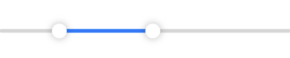
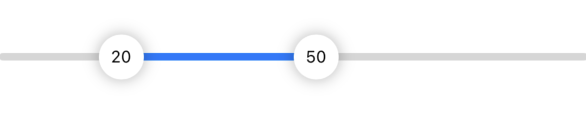
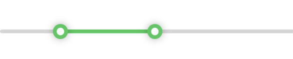

# RangeSlider

RangeSlider is a customizable Swift package that provides a simple and intuitive way to work with range sliders in iOS and macOS applications.
It supports binding to a `ClosedRange<Double>` and can also be initialized with two `Double` values. 
The package is compatible with iOS 14 and later, as well as macOS 11 and later.

- [Features](#features)
- [Requirenents](#requirements)
- [Swift Package Manager](#swift-packager-manager)
- [Usage](#usage)
  - [Basic Usage](#basic-usage)
  - [Bind Two Values](#bind-two-values)
- [Customizing UI](#customizing-ui)
  - [Simple API](#simple-api)
  - [Advences](#advences)
  - [Add Overlay to Thumb](#add-overlay-to-thumb)
- [Screenshot](#screenshots)
- [Installation](#installation)
  - [Swift Package Manager](#swift-package-manager)
- [License](#license)

## Features

- **Binding to `ClosedRange<Double>`**: Easily bind the slider to a range of values.
- **Multiple Initializers**: Initialize the slider with either a `ClosedRange<Double>` or two `Double` values.
- **Customizable UI**: Simple API with options to customize the slider's appearance.
- **Change with Step**: Change binded value with given step.
- **Cross-Platform Support**: Works on both iOS and macOS.

## Requirements

- iOS 14.0+ / macOS 11.0+
- Swift 5.0+

## Usage

### Basic Usage
Here's how you can use the `RangeSlider` with a `ClosedRange<Double>`:

```swift
struct ContentView: View {
    @State private var selection: ClosedRange<Double> = 0.0...100.0
    
    var body: some View {
        RangeSlider(selection: $selection)
            .padding()
    }
}
```

### Bind Two Values
You can also initialize the `RangeSlider` with two `Double` values:

```swift
struct ContentView: View {
    @State private var lowerBound: Double = 10.0
    @State private var upperBound: Double = 90.0
    
    var body: some View {
        RangeSlider(lowerBound: $lowerBound, upperBound: $upperBound)
            .padding()
    }
}
```

## Customizing the UI

### Simple API
You can customize the appearance of the `RangeSlider` by using the available modifiers:

```swift
import RangeSlider

struct ContentView: View {
    @State private var selection: ClosedRange<Double> = 0.0...100.0
    
    var body: some View {
        RangeSlider(selection: $selection)
            .track(.black)
            .thumb(color: .blue)
    }
}
```

### Advances
For more advanced customization, you can use the following example:
```swift
struct ContentView: View {
    @State private var selection: ClosedRange<Double> = 20.0...80.0

    var body: some View {
        RangeSlider(selection: $selection, in: 0...100)
        .thumb(scale: 30)
        .thumbStyle(.strokeLine)
        .thumb(color: .white)
        .trackBackgroundHidden()
        .thumbShadownHidden()
        .track(height: 40)
    }
}
```

### Add Overlay to Thumb
Use initializer `init(selection:in:step:thumbOverlay:)` or `init(lowerBound:upperBound:in:step:thumbOverlay:)` to add overlay to the thumb.  
Given a `Direction` to distinguish between the two thumbs.
```swift
RangeSlider(selection: $selection) { direction in
    if direction == .left {
        // views for left thumb
        Text(String(format: "%.0f", selection.lowerBound))
    }else {
        // views for right thumb
        Text(String(format: "%.0f", selection.upperBound))
    }
}
.thumb(scale: 30)
.font(.caption)
```

For more API information, please check [RangeSlider.swift](Sources/RangeSlider/RangeSlider.swift),
[Inits.swift](Sources/RangeSlider/Inits.swift), and [Modifiers.swift](Sources/RangeSlider/Views/Modifiers.swift).  
If your using Xcode, right click the target API or structure, then click `Show Quick Help` to read the documentation.

## Screenshots

<div>
  
  
  
  
<div/>

## Installation

### Swift Package Manager

1. Select `Xcode` -> `File` -> `Swiftr Package` -> `Add Dependency...`.
2. Enter `https://github.com/haner0834/RangeSlider`.
3. Click `Next`, then select the version, complete.

## Contributing

Contributions are welcome! If you have any suggestions or find a bug, please open an issue or submit a pull request.

## License

RangeSlider is available under the MIT license. See the LICENSE file for more info.
