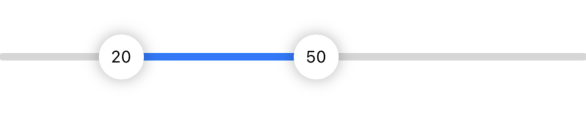
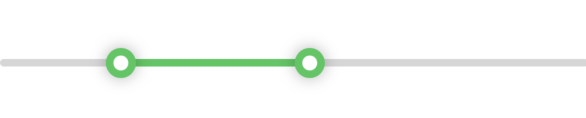

# RangeSlider

Language: [English](README.md) | [中文](README_zh.md)

RangeSlider 是一個可自定義UI的Swift Package，兼容iOS和macOS。
它提供了簡單的方法創造一個綁定`ClosedRange<Double>`的滑塊，也可以透過兩個`Double`值初始化。
此Package兼容iOS 14（含）以上，或macOS 11（含）以上

- [功能](#功能)
- [要求](#要求)
- [Swift 包管理器](#swift-包管理器)
- [用法](#用法)
  - [基本用法](#基本用法)
  - [綁定兩個值](#綁定兩個值)
- [自定義 UI](#自定義-ui)
  - [簡單的 API](#簡單的-api)
  - [進階自定義](#進階自定義)
  - [為Thumb 添加 Overlay](#為thumb-添加-overlay)
- [截圖](#截圖)
- [安裝](#安裝)
  - [Swift Package Manager](#swift-package-manager)
- [許可](#許可)

## 功能

- **綁定到 `ClosedRange<Double>`**：輕松綁定滑塊到一組值。
- **多種初始化方式**：可以通過 `ClosedRange<Double>` 或兩個 `Double` 值進行初始化滑塊。
- **可定制的 UI**：簡單的 API，可以自定義滑塊的外觀。
- **步進變化**：以給定的步長更改綁定值。
- **跨平台支持**：支持 iOS 和 macOS。

## 要求

- iOS 14.0+ / macOS 11.0+
- Swift 5.0+

## 用法

### 基本用法
以下是如何使用 `RangeSlider` 綁定一個 `ClosedRange<Double>` 的示例：

```swift
struct ContentView: View {
    @State private var selection: ClosedRange<Double> = 0.0...100.0
    
    var body: some View {
        RangeSlider(selection: $selection)
            .padding()
    }
}
```

### 綁定兩個值
你也可以透過兩個`Double`值進行初始化：

```swift
struct ContentView: View {
    @State private var lowerBound: Double = 10.0
    @State private var upperBound: Double = 90.0
    
    var body: some View {
        RangeSlider(lowerBound: $lowerBound, upperBound: $upperBound)
            .padding()
    }
}
```

## 自定義UI

### 簡單的 API
你可以使用可用的修飾符自定義 RangeSlider 的外觀：

```swift
struct ContentView: View {
    @State private var selection: ClosedRange<Double> = 0.0...100.0
    
    var body: some View {
        RangeSlider(selection: $selection)
            .track(.black)
            .thumb(color: .blue)
    }
}
```

### 進階自定義
對於更進階的自定義UI，可以依照下面的例子：
```swift
struct ContentView: View {
    @State private var selection: ClosedRange<Double> = 20.0...80.0

    var body: some View {
        RangeSlider(selection: $selection, in: 0...100)
            .thumb(scale: 30)
            .thumbStyle(.strokeLine)
            .thumb(color: .white)
            .trackBackgroundHidden()
            .thumbShadownHidden()
            .track(height: 40)
    }
}
```

## 為Thumb 添加 Overlay
使用初始化方法 `init(selection:in:step:thumbOverlay:)` 或 `init(lowerBound:upperBound:in:step:thumbOverlay:)` 為Thumb 添加 Overlay。  
給定一個 `Direction` 來區分兩個Thumb。

```swift
RangeSlider(selection: $selection) { direction in
    if direction == .left {
        // 左侧拇指的视图
        Text(String(format: "%.0f", selection.lowerBound))
    } else {
        // 右侧拇指的视图
        Text(String(format: "%.0f", selection.upperBound))
    }
}
.thumb(scale: 30)
.font(.caption)
```

有關更多 API 的資訊，請查看 [RangeSlider.swift](Sources/RangeSlider/RangeSlider.swift)，
[Inits.swift](Sources/RangeSlider/Inits.swift)，和 [Modifiers.swift](Sources/RangeSlider/Views/Modifiers.swift)。  
如果是使用 Xcode，右鍵點擊目標 API 或structure，然後點擊 `Show Quick Help` 來閱讀文檔。

## 截圖

<div>
  
  
  
  
<div/>

## 安裝

### Swift Package Manager
1. 選擇 `Xcode` -> `File` -> `Swift Packages` -> `Add Dependency...`。
2. 輸入 `https://github.com/haner0834/RangeSlider`。
3. 點擊 `Next`，然後選擇版本。

## 貢獻

歡迎貢獻！如果你有任何建議或發現任何 bug，請提交 issue 或 pull request。

## 許可

RangeSlider 根據 MIT 許可證發布。查看 LICENSE 文件了解更多信息。
